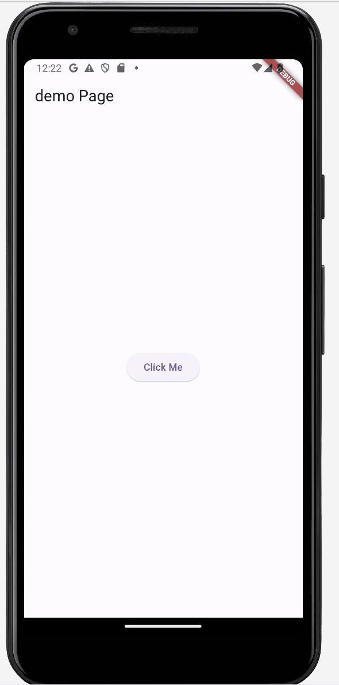

## Features

This package provides a circular spinning wheel with up to 8 buttons. It’s designed to be visually appealing and highly customizable. Feel free to tailor it to your needs and make it look beautiful!

## Preview


## Getting Started

To use the `spinning_wheel_button` package, follow the steps below:

### 1. Add Dependency
Add the package to your `pubspec.yaml` file:

```yaml
dependencies:
  spinning_wheel_button: <latest-version>
``` 

### 2. Run pub get
```
flutter pub get
```

### 3. Import package
```
import 'package:spinning_wheel_button/spinning_wheel_button.dart';
```

## Usage

### Simple usage

```dart
class MyHomePage extends StatelessWidget {

  @override
  Widget build(BuildContext context) {
    return Scaffold(
      body: Center(
        child: ElevatedButton(
          onPressed: () {
            showDialog(
              context: context,
              builder: (BuildContext context) {
                return Center(
                  child: WheelButton(
                    bottom: 20,
                    containerSize: 300,
                    containerBgColor: Colors.white,
                    showLines: true,
                    borderColor: Colors.transparent,
                    borderWidth: 2,
                    centerWidget: GestureDetector(
                      onTap: () {
                        Navigator.of(context).pop();
                      },
                      child: Icon(Icons.circle, size: 56, color: Colors.green),
                    ),
                    buttons: [
                      EachButton(
                        icon: Icons.music_note,
                        imageOrIconColor : Colors.green,
                        label: 'music',
                        labelStyle: const TextStyle(fontSize: 15),
                        onTap: () {
                          print('Button 1 clicked');
                        },
                      ),
                      EachButton(
                        icon: Icons.person_outline_sharp,
                        imageOrIconColor : Colors.green,

                        label: 'myPage',
                        labelStyle: const TextStyle(fontSize: 15),
                        onTap: () {
                          print('Button 2 clicked');
                        },
                      ),
                      EachButton(
                        icon: Icons.pin_drop,
                        imageOrIconColor : Colors.green,

                        label: 'location',
                        labelStyle: const TextStyle(fontSize: 15),
                        onTap: () {
                          print('Button 3 clicked');
                        },
                      ),
                      EachButton(
                        icon: Icons.mic_none_sharp,
                        imageOrIconColor : Colors.green,

                        label: 'record',
                        labelStyle: const TextStyle(fontSize: 15),
                        onTap: () {
                          print('Button 4 clicked');
                        },
                      ),
                      EachButton(
                        icon: Icons.qr_code,
                        imageOrIconColor : Colors.green,

                        label: 'qr_code',
                        labelStyle: const TextStyle(fontSize: 15),
                        onTap: () {
                          print('Button 5 clicked');
                        },
                      ),
                      EachButton(
                        icon: Icons.photo_camera,
                        imageOrIconColor : Colors.green,

                        label: 'photo',
                        labelStyle: const TextStyle(fontSize: 15),
                        onTap: () {
                          print('Button 6 clicked');
                        },
                      ),
                    ],
                  ),
                );
              },
            );
          },
          child: const Text('Click Me'),
        ),
      ),
    );
  }
}
```

You can add up to 8 buttons and customize the central button (centerWidget) to include any functionality you desire.

## Class Parameters

### 1. CircleDiagonalLinePainter Class

| Parameter         | Type     | Description                                         | Default Value      |
|-------------------|----------|-----------------------------------------------------|--------------------|
| `numberOfButtons` | `int`    | The number of buttons on the wheel                  | **Required**       |
| `lineColor`       | `Color`  | The color of the diagonal lines                     | `Color(0xFFffffff)`|
| `strokeWidth`     | `double` | The width (thickness) of the lines                  | `2`                |
| `lineEnd`         | `double` | The distance from the center to the end of the lines| `2`                |

---

### 2. EachButton Class

| Parameter          | Type            | Description                                     | Default Value      |
|--------------------|-----------------|-------------------------------------------------|--------------------|
| `buttonSizeWidth`  | `double?`       | The width of the button                         | `56`               |
| `buttonSizeHeight` | `double?`       | The height of the button                        | `56`               |
| `imagePath`        | `String?`       | The path to the image displayed on the button   | `None`             |
| `icon`             | `IconData?`     | The icon displayed on the button                | `None`             |
| `imageOrIconColor` | `Color?`        | The color of the image or icon                  | `Colors.black`     |
| `label`            | `String?`       | The label text displayed below the button       | `None`             |
| `imageSize`        | `double`        | The size of the image or icon                   | `24`               |
| `labelStyle`       | `TextStyle?`    | The text style for the label                    | `None`             |
| `onTap`            | `VoidCallback?` | The callback function triggered when the button is clicked | `None`     |

---

### 3. WheelButton Class

| Parameter          | Type                | Description                                     | Default Value      |
|--------------------|---------------------|-------------------------------------------------|--------------------|
| `bottom`           | `double`            | The position of the widget from the bottom      | `0`                |
| `containerSize`    | `double`            | The size (diameter) of the spinning wheel container | `300`         |
| `containerBgColor` | `Color`             | The background color of the spinning wheel container | `Colors.white` |
| `borderColor`      | `Color`             | The color of the border around the wheel        | `Color(0xFFE7E6E4)`|
| `borderWidth`      | `double`            | The width of the border around the wheel        | `1.0`              |
| `buttons`          | `List<EachButton>`  | A list of buttons to be displayed on the wheel (max 8 buttons) | **Required** |
| `showLines`        | `bool`              | Whether to show dividing lines between buttons  | `false`            |
| `centerWidget`     | `Widget?`           | The widget displayed at the center of the wheel | `None`             |


## Author
✨ Haehyeon yun (hennie) ✨ 